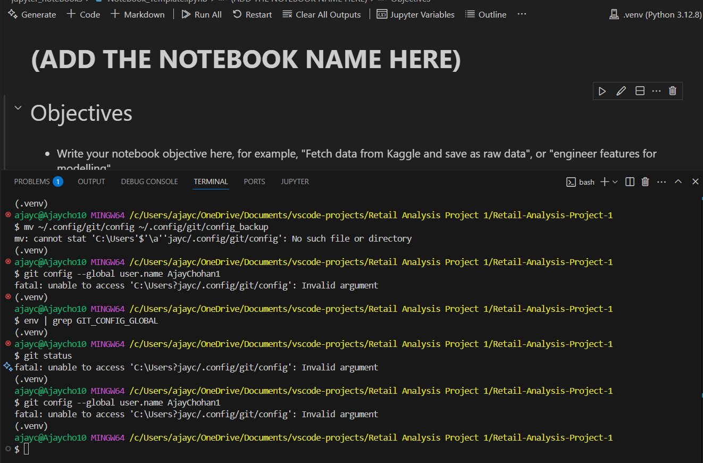

# Retail Sales Data ETL & Visualisation

Retail Sales Analysis: This project is a part of the **Data Analytics with AI Individual Formative Assignment**. It demonstrates an **end-to-end ETL (Extract, Transform, Load)** pipeline and various **data visualisations** using Python tools like Pandas, Matplotlib, Seaborn, and Plotly.

# 

## Dataset Content
* To analyse retail sales data and visualise key business insights using Python ETL and visualisation tools.- Source: [Kaggle Retail Dataset](https://www.kaggle.com/datasets/manjeetsingh/retaildataset)
- Features_data_set
- sales_data-set
- stores_data-set

## Business Requirements
* Understand sales trends over time.
* Determine the impact of promotional markdowns on sales.
* Compare holiday vs non-holiday sales patterns.
* Identify regional and store-type differences.
* Create clear visual dashboards to communicate findings.

## Hypothesis and how to validate?
* List here your project hypothesis(es) and how you envision validating it (them)
| Hypothesis                                         | Validation Method
| Promotional markdowns increase sales.              | Use bar/line plots to compare sales with/without markdowns.|
| Holiday weeks have higher sales.                   | Compare average sales in holiday vs non-holiday weeks.
| Larger stores perform better in sales.             | Group sales by store size and compare with bar plots.
| Certain departments perform better with markdowns. | Analyze markdown vs sales per department.|

## Project Plan
* Outline the high-level steps taken for the analysis.
* How was the data managed throughout the collection, processing, analysis and interpretation steps?
* Why did you choose the research methodologies you used?
* ETL Pipeline: Structured method ensures clean, ready-to-analyze data.
* Descriptive Statistics: First step to understanding trends.
* Data Visualisation: Converts complex numbers into easy-to-understand insights.
* Comparative Analysis: Helps with strategic business decisions.
#
| Stage          | Management Details                                            |
| -------------- | ------------------------------------------------------------- |
| Collection     | Loaded from Excel using `cleaned_data_set.csv()`              |
| Processing     | Cleaned missing values, merged datasets, created new features |
| Analysis       | Used statistical summaries and visual plots                   |
| Interpretation | Derived insights and supported them with graphs & commentary  |

## The rationale to map the business requirements to the Data Visualisations
* List your business requirements and a rationale to map them to the Data Visualisations
# | Requirement                    | Visualisation                       |Rationale|
| Identify trends                | Line plot of sales over time        | Shows how sales change weekly            |
| Markdown impact                | Bar chart: markdown vs sales        | Visualises relationship                  |
| Holiday vs non-holiday         | Box plot or grouped bar plot        | Easily compare the distributions         |
| Regional/store-type comparison | Heatmap or grouped bar              | Displays performance differences clearly |
| Report-ready visuals           | Plotly Dash or Seaborn style charts | Interactive and professional appearance  |

## Analysis techniques used
* List the data analysis methods used and explain limitations or alternative approaches.
* How did you structure the data analysis techniques. Justify your response.
* Did the data limit you, and did you use an alternative approach to meet these challenges?
* How did you use generative AI tools to help with ideation, design thinking and code optimisation?

## Ethical considerations
* Were there any data privacy, bias or fairness issues with the data?
* How did you overcome any legal or societal issues?

## Dashboard Design
* List all dashboard pages and their content, either blocks of information or widgets, like buttons, checkboxes, images, or any other item that your dashboard library supports.
* Later, during the project development, you may revisit your dashboard plan to update a given feature (for example, at the beginning of the project you were confident you would use a given plot to display an insight but subsequently you used another plot type).
* How were data insights communicated to technical and non-technical audiences?
* Explain how the dashboard was designed to communicate complex data insights to different audiences. 

## Fixed errors and bugs
  - Below is the issues of some of the bugs encountered whilst starting up VS code to log into Copilot and git it self. This stopped my progress to even start the project, numerous hours of trial and error to then understand that my user name on my laptop profile clashed with the coding in the terminal bash which I then could not enter anything with git: add, commit -m or push. After finally getting the error and bugs fixed through reinstallation of the applications and creating a new system environment I was then able to start my project on Sunday (2 days after the project had begun)
  - 
  - 025-06-12 13:23:22.459 [info] [certificates] Removed 10 expired certificates
  - 2025-06-12 13:24:22.787 [error] [default] github.copilot.signIn: TokenResultError--[CopilotAuthError]: Timed out waiting for authentication provider to register
  - at getSessionHelper (c:\Users\ajayc\.vscode\extensions\github.copilot-1.333.0\extension\src\session.ts:84:42)
    at signInCommand (c:\Users\ajayc\.vscode\extensions\github.copilot-1.333.0\extension\src\auth.ts:24:5)
    at c:\Users\ajayc\.vscode\extensions\github.copilot-1.333.0\extension\src\telemetry.ts:25:13
    at Wb.h (file:///c:/Users/ajayc/AppData/Local/Programs/Microsoft%20VS%20Code/resources/app/out/vs/workbench/api/node/extensionHostProcess.js:119:41516) {
  result: {
    reason: 'NotSignedIn',
    message: 'Timed out waiting for authentication provider to register'
  },
  [cause]: undefined
}

## Unfixed Bugs
* Please mention unfixed bugs and why they were not fixed. This section should include shortcomings of the frameworks or technologies used. Although time can be a significant variable to consider, paucity of time and difficulty understanding implementation are not valid reasons to leave bugs unfixed.
* Did you recognise gaps in your knowledge, and how did you address them?
* If applicable, include evidence of feedback received (from peers or instructors) and how it improved your approach or understanding.

## Development Roadmap
* What challenges did you face, and what strategies were used to overcome these challenges?
* What new skills or tools do you plan to learn next based on your project experience? 

## Deployment
### Heroku

* The App live link is: https://YOUR_APP_NAME.herokuapp.com/ 
* Set the runtime.txt Python version to a [Heroku-20](https://devcenter.heroku.com/articles/python-support#supported-runtimes) stack currently supported version.
* The project was deployed to Heroku using the following steps.

1. Log in to Heroku and create an App
2. From the Deploy tab, select GitHub as the deployment method.
3. Select your repository name and click Search. Once it is found, click Connect.
4. Select the branch you want to deploy, then click Deploy Branch.
5. The deployment process should happen smoothly if all deployment files are fully functional. Click now the button Open App on the top of the page to access your App.
6. If the slug size is too large then add large files not required for the app to the .slugignore file.

## Main Data Analysis Libraries
* Here you should list the libraries you used in the project and provide an example(s) of how you used these libraries.

## Credits 

* In this section, you need to reference where you got your content, media and extra help from. It is common practice to use code from other repositories and tutorials, however, it is important to be very specific about these sources to avoid plagiarism. 
* You can break the credits section up into Content and Media, depending on what you have included in your project. 

### Content 

- The text for the Home page was taken from Wikipedia Article A
- Instructions on how to implement form validation on the Sign-Up page was taken from [Specific YouTube Tutorial](https://www.youtube.com/)
- The icons in the footer were taken from [Font Awesome](https://fontawesome.com/)

### Media

- The photos used on the home and sign-up page are from This Open-Source site
- The images used for the gallery page were taken from this other open-source site

## Acknowledgements (optional)
* Thank the people who provided support through this project.
